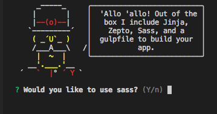

> [Yeoman](http://yeoman.io) generator that scaffolds out a front-end web app using [gulp](http://gulpjs.com/) for the build process

# Description:
Creates a new basic front-end web project for jinja template test and create.

# Feature

Sass: Include Sass

## Getting Started

- Install: `npm install --global yo gulp-cli generator-jinja`
- Run `mkdir test_project && yo jina` to scaffold your webapp
- Run `gulp dev` to preview and watch for changes
- Run `gulp proc` to build your jinja template for production, file is in `dist/release`

## Options

- `--skip-welcome-message`
  Skips Yeoman's greeting before displaying options.
- `--skip-install-message`
  Skips the the message displayed after scaffolding has finished and before the dependencies are being installed.
- `--skip-install`
  Skips the automatic execution of `bower` and `npm` after scaffolding has finished.

## License

[BSD license](http://opensource.org/licenses/bsd-license.php)